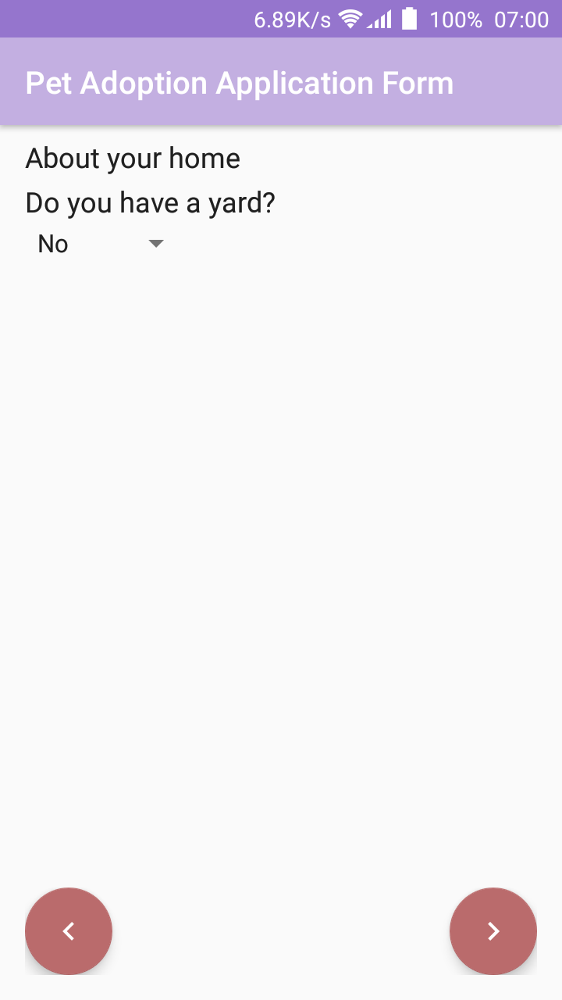

# Adopt a Pet

## App Description
App populates sets of views dynamically based on questions read from a JSON file

## Screenshot
  

## App features
* App dynamically displays views based on input from JSON file. Showing/hiding views as appropriate
* Makes use of Espresso to test aspects of the UI.
* Saves states of fragments and avoids recreating them if they already exist

## Getting Started

The app uses the Gradle build system. To build this project, use the
"gradlew build" command or use "Import Project" in Android Studio.

## Prerequisites

- Android SDK v28
- Android Build Tools v27.0.3
- Android Support Repository v28.0.0
- Gradle 3.2.1

## Libraries
*   [Gson](https://github.com/google/gson)
*   [Picasso](http://square.github.io/picasso/)

## Author

Zizoh Anto

## License

This project is licensed under the Apache License 2.0 - See: http://www.apache.org/licenses/LICENSE-2.0.txt
